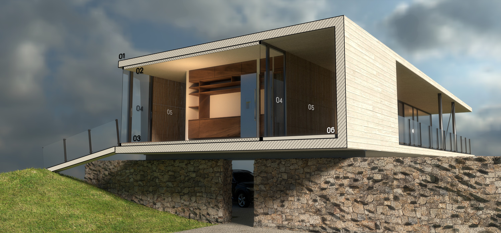

# The nature house

*concept, project and illustrations by Maíra Zasso and Yorik van Havre, [uncreated.net](http://www.uncreated.net)*

A modernist house in the grand tradition of Brazilian modernist dream houses, that works in northern hemisphere climates.

### Return to the nature

Today we all see that the accelerated industrialization we've been living in during the last decades is going too far. The climate of our planet is suffering dangerously, as well as our own human bodies. We are consuming too much, and relying too much on an endless chain of polluting technologies, each one pretending to solve the problems created by the previous one. Many of us feel the urgent need to escape that cycle, and rediscover a lifestyle more connected to nature and simplicity.

This house places you inside the nature. At any moment, from any point, you see, hear and feel nature around you. A minimum of artificial, and a maximum of natural. It works of course best on large terrains, but can be accommodated on smaller terrains as well, using of a lot of vegetation and playing intelligently with the topography.

### Modernist heritage

Modernist architects all over the world, back in the 40s, had a strong understanding of the need for connection between the human being and natural elements such as fresh air and sun, and the delicate balance between built volumes and open spaces. Unfortunately, after the masters vanished, what their descendants and the world remembered of modernism was the aspect, the white, ascetic forms, and forgot about those very fundamental ideas. The next decades, obviously, saw the emergence of strong anti-modernist movements. Today, we are finally able to make peace with our past, and make something new out of these precious, original ideas.

This house doesn't try to be of any style. It tries to offer a simple and direct connection between you and the world around you. This means being able to see, hear or feel the outside, but also touch raw materials, feel their temperature, and their connection to the very earth. 

### Great climatic behaviour

One of the place in the world where modernist architecture has best survived with its original meaning is Brazil. The perfect climate, that in most of the country renders heating or cooling unnecessary, pushed the flourishing of these marvellous houses, nested in the middle of dense native vegetation, where it is possible to open a large part (if not all) of the glass walls, and let the outside enter the house.

"Here is not Italy, this will never work here" said people when the Copenhagen city architects proposed to create throughout the city a series of cycle routes, open spaces, terraces and places for people to simply sit and enjoy being outside. After these were implemented, not only are they extensively used the whole year round, even under freezing temperatures, but they also changed Copenhagen deeply and turned it one of the cities with the highest life quality worldwide. Today, the pedestrian, car free shopping area Strøget is the Copenhagen postcard. We believe that contact with nature is something we all want, no matter where in the world.

We cannot leave all our windows open the whole year round, like in Brazil, when we live under more northern latitudes, that is true. That doesn't mean we don't like to open them wide, during the time when it is possible. That also doesn't mean we couldn't enjoy that contact under another form, during the winter months.

