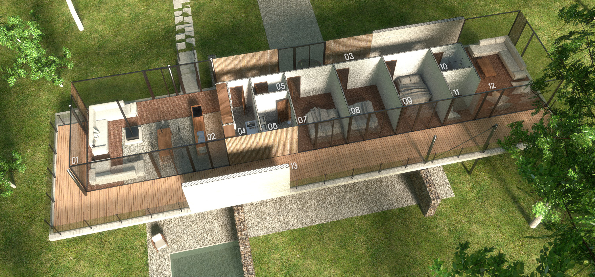

# Casa natureza

*conceito, projeto e ilustrações por Maíra Zasso e Yorik van Havre, [uncreated.net](http://www.uncreated.net)*

Uma casa modernista da grande tradição brasileira do ideal das casas modernistas, que funciona para os climas do hemisfério norte.

### Retorno à natureza

Hoje todos nós vemos que a industrialização acelerada que nós temos vivido durante as últimas décadas está indo longe demais. O clima do nosso planeta está sofrendo perigosamente, bem como nossos próprios corpos humanos. Estamos consumindo muito, e confiando demais em uma cadeia interminável de tecnologias poluentes, onde cada uma finge resolver os problemas criados pela anterior. Muitos de nós sentem a necessidade urgente de escapar desse ciclo, e redescobrir um estilo de vida mais ligado à natureza e simplicidade.

Esta casa coloca você dentro da natureza. A qualquer momento, a partir de qualquer ponto, você vê, ouve e sente a natureza ao seu redor. Um mínimo de artificial e um máximo de natural. Ela funciona naturalmente melhor em grandes terrenos, mas pode ser acomodada em terrenos menores também, usando muita vegetação e jogando de forma inteligente com a topografia.

### Herança modernista

Arquitetos modernistas em todo o mundo, de volta à década de 40, tiveram uma forte compreensão da necessidade de uma conexão entre o ser humano e elementos naturais, como ar fresco e sol, e o delicado equilíbrio entre os volumes construídos e espaços abertos. Infelizmente, depois que os mestres desapareceram, o que os seus descendentes e o mundo lembraram do modernismo foi o aspecto, as, formas ascéticas brancas, e esqueceu-se sobre essas ideias muito fundamentais. As próximas décadas, evidentemente, viram o surgimento de fortes movimentos anti-modernistas. Hoje, estamos finalmente em condições de fazer as pazes com nosso passado e fazer algo novo a partir dessas preciosas ideias originais.

Esta casa não tenta ser de qualquer estilo. Ele tenta oferecer uma conexão simples e direta entre você e o mundo ao seu redor. Isso significa ser capaz de ver, ouvir ou sentir o exterior, e também tocar em matérias-primas, sentir a sua temperatura e sua conexão com a própria terra.

### Ótimo comportamento climático

Um dos lugares no mundo onde a arquitetura modernista melhor sobreviveu com seu significado original é o Brasil. O clima perfeito, que, na maior parte do país torna o aquecimento ou arrefecimento desnecessário, empurrou o florescimento destas casas maravilhosas, aninhadas no meio da densa vegetação nativa, onde é possível abrir uma grande parte (se não toda) das peles de vidro e deixar o lado de fora entrar na casa.

"Aqui não é a Itália, isto nunca vai funcionar aqui", disse o povo, quando os arquitetos da cidade de Copenhagem propuseram em toda a cidade a criação de uma série de ciclovias, espaços abertos, terraços e lugares para que as pessoas simplesmente pudessem sentar e desfrutar de estar fora. Após terem sido implementados, não só eles são amplamente utilizados durante todo o ano, mesmo sob temperaturas congelantes, mas também mudaram Copenhagen profundamente e tornando-a uma das cidades com maior qualidade de vida em todo o mundo. Hoje, a área comercial pedestre e livre de carros Strøget é o cartão postal de Copenhagem. Acreditamos que o contato com a natureza é algo que todos nós desejamos, não importa onde no mundo.

Não podemos deixar todas as nossas janelas abertas durante todo o ano, como no Brasil, quando vivemos em latitudes mais ao norte, isso é verdade. Isso não significa que nós não gostaríamos de abri-las amplamente, durante o tempo em que é possível. Isso também não significa que nós não poderíamos aproveitar esse contato sob outra forma, durante os meses de inverno.

1. laje de concreto
2. teto isolante
3. piso isolante
4. vidro de alto desempenho
5. sombreamento de bambu sobre o vidro ou painéis isolantes
6. deck de madeira

Esta casa oferece grandes paredes de vidro, que podem ser amplamente e sem qualquer controle abertas durante todos os dias de verão, tornando os diferentes espaços interiores totalmente parte do lado de fora, e fazer você se sentir como se estivesse no Brasil. Durante o inverno, o seu isolamento altamente inovador a torna quase uma casa passiva. Uma concha de concreto externa funciona como um exoesqueleto de proteção. No interior, uma caixa térmica, literalmente, uma caixa dentro de outra caixa, é totalmente livre de elementos estruturais, o que a torna também totalmente livre de pontes térmicas, e fácil de aquecer. Tudo isto é conseguido com bom senso, bom pensamento e idéias simples, ao invés de tecnologias pesadas. Esta casa simplesmente não precisa delas. E mesmo durante os dias de inverno rigoroso, você nunca perde o contato com a natureza. Isso visualmente, graças às grandes janelas, mas também por causa dos materiais brutos e simples que estão infiltrados em seu interior.

### Um design de código aberto e internacional

Esta casa adquiriu o conhecimento combinado de uma equipe de arquitetos brasileiros, europeus e norte-americanos. Nós entendemos as qualidades e a sensação única dessas casas brasileiras ideais, sabemos como elas funcionam e o que as faz formidáveis. Nós também temos uma enorme experiência de trabalho em países mais frios, sabemos o que faz um isolamento bom e eficiente, e nós temos ao longo do tempo desenvolvido várias idéias para fazer ambos os lados trabalharem juntos.

O projeto desta casa também tem o código totalmente aberto, o que permite uma alta permeabilidade das ideias. Ao ser usado por outras pessoas, ele também se beneficia do que as outras pessoas fazem, e novas ideias taçhadas no mundo todo são fáceis de adaptar e incorporar. Acreditamos que este é seu o verdadeiro e último significado que a habitação passiva e de baixo consumo deve alcançar, em vez de se tornar refém de poucas soluções de alta tecnologia.

### Quanto custa?

Infelizmente, é impossível dar uma resposta direta a esta pergunta. Existem muitas variáveis que dependem de condições locais, tais como o clima, o terreno, que pode exigir fundações profundas ou não, a disponibilidade e preço dos materiais próximos ao terreno, e de construtores capazes de lidar com as matérias-primas deste casa com qualidade.

No entanto, graças ao uso da tecnologia BIM, uma lista de quantidades está sendo elaborada em conjunto com o projeto. Este quantitativo enumera todos os itens necessários para construir a casa. Com essa lista em mãos, você será capaz de ir a uma empresa de construção, ou orçamentista mais próximo, e pedir para colocar os preços em cada item.

O projeto da casa também pode ser profundamente modificado sem perder suas qualidades fundamentais. Isso permite que uma grande modificação de quantidade de espaço e do orçamento, para cima ou para baixo.

1. sala de estar e sala de jantar "públicos": 35,90 m² / 386,5 SQF
2. cozinha: 8,55 m² / 92 SQF
3. entrada/corredor: 28,44 m² / 306 SQF
4. área de serviço: 5,41 m² / 58 SQF
5. lavatório: 2,37 m² / 25,5 SQF
6. banho: 4,78 m² / 51,5 SQF
7. suíte: 11,30 m² / 121,5 SQF
8. dormitório: 11,30 m² / 121,5 SQF
9. dormitório: 11,30 m² / 121,5 SQF
10. banheiro: 3,51 m² / 38 SQF
11. escritório: 3,70 m² / 40 SQF
12. sala de estar "privada": 26,5 m² / 285 SQF
13. terraço: 70,69 m² / 761 SQF

